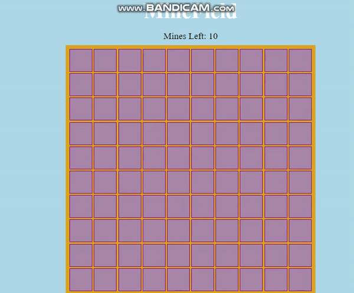

<h1 align="center">MineField Game</h1>

<h3>Overview</h3>
👨‍💻 In this project I mastered division and functional programming skills. I used mainly HTML, CSS and JS (DOM Manipulation). You can see visual demo of the website below. The objective is to build out this real-like webpage and make it looking as professional as possible..
<hr>

## ✨ Demo

 <p align="center">
     
</p>

<!--   -->

<hr>

[📍click here to see page](https://yasinsutoglu.github.io/MineField-Game/)

<!-- ------------------------------------------------------ -->

## Project Skeleton 

```
Game Project (folder)
|
|----readme.md              
|----img           
|----solution
        |----index.html  
        |----style.css 
        |----script.js  
        |----logic.js
```

<!-- --------------------------------------- -->
### Purpose of Project;

👨‍💻 The main aim of this project is to improve my <b>HTML/CSS/JS/git commands (push, pull, commit, add etc.) skills and responsive design abilities</b>.


## Objective

🎯

### The project covers;

- HTML / Semantic elements 

- CSS / Flexbox - Grid 

- JS / DOM Manipulation - Arrow Function - Destructuring - Events - Conditionals - Loops - Bind - Array Methods - Objects
### At the end of the project, i will be able to;

- improve coding skills within HTML & CSS & JS

- use git commands (push, pull, commit, add etc.) and Github as Version Control System.

<hr>
<h3>Used in this project</h3>

👉 HTML tags, Comments, CSS styling, JS DOM etc.


<hr>
<h3>How to Use the Project</h3>
<span>First download a code editor </span>
<br><span>Second open the files : </span><a href='https://github.com/yasinsutoglu/parallax-page'>My Docs</a>
<br><span>You can use this tutorial : </span><a href='https://www.youtube.com/watch?v=fJEbVCrEMSE'>VS Code tutorial</a>

<!-- ------------------------------------------------------------------------- -->
<!-- ## 🚀 Usage

Make sure you have [npx](https://www.npmjs.com/package/npx) installed (`npx` is shipped by default since npm `5.2.0`)

Just run the following command at the root of your project and answer questions:

```sh
npx readme-md-generator
```

Or use default values for all questions (`-y`):

```sh
npx readme-md-generator -y
```

Use your own `ejs` README template (`-p`):

```sh
npx readme-md-generator -p path/to/my/own/template.md
```

You can find [ejs README template examples here](https://github.com/kefranabg/readme-md-generator/tree/master/templates). -->

<!-- -------------------------------------------------------------------------- -->

<!-- ## Code Contributors

This project exists thanks to all the people who contribute. [[Contribute](CONTRIBUTING.md)].
<a href="https://github.com/kefranabg/readme-md-generator/graphs/contributors"></a>
 -->

<!-- ## 🤝 Contributing

Contributions, issues and feature requests are welcome.<br />
Feel free to check [issues page](https://github.com/kefranabg/readme-md-generator/issues) if you want to contribute.<br />
[Check the contributing guide](./CONTRIBUTING.md).<br /> -->


<!-- ------------------------------------------------------------------------------------- -->
## Author

👤 **Yasin Sutoglu**

- Twitter: [@YsnStgl](https://twitter.com/YsnStgl)
- Github: [@yasinsutoglu](https://github.com/yasinsutoglu)

